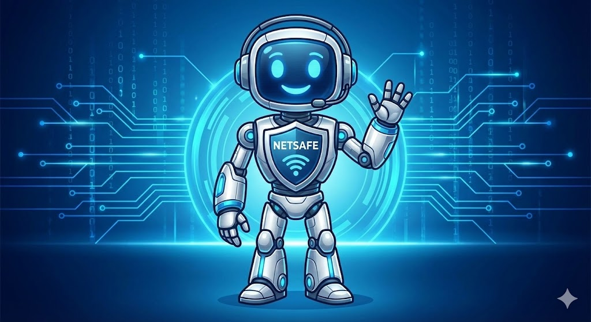

<h1 align="center">
  🛡️ NetSafe AI: Assistente Inteligente do Project Aegis
</h1>

  

---

## 🚀 1. Descrição do Projeto

O **NetSafe AI** é o módulo de Inteligência Artificial integrado ao **Project Aegis**, o Painel de Inteligência de Ameaças Cibernéticas.

Desenvolvido como um chatbot conversacional, o NetSafe atua como um analista de segurança virtual, permitindo que usuários de todos os níveis técnicos interajam com os dados complexos do painel usando linguagem natural.

Em vez de navegar por múltiplos gráficos e tabelas, o usuário pode simplesmente perguntar: *"Qual é o setor mais atacado hoje?"* ou *"O que é uma CVE?"*, e o NetSafe fornecerá uma resposta imediata, técnica e contextualizada, democratizando o acesso à informação de cibersegurança.

---

## 🎯 2. Objetivos e Funcionalidades

Este projeto foi desenvolvido com foco na disciplina de **Interação Humano-Computador (IHC)**, visando melhorar a usabilidade e a acessibilidade do Project Aegis.

### Funcionalidades Principais:

✅ **Processamento de Linguagem Natural (NLP):** Utiliza o modelo **Google Gemini 2.0 Flash** para entender perguntas complexas em português e gerar respostas coerentes.

✅ **RAG (Retrieval-Augmented Generation):** Implementa um sistema de "Geração Aumentada por Recuperação". O chatbot consulta uma base de conhecimento interna (`dados_seguranca.json`) sobre o projeto antes de responder, garantindo que as informações sejam precisas e específicas do Aegis, reduzindo alucinações da IA.

✅ **Interface Inclusiva:**
  - **Botão Flutuante:** Acesso rápido em qualquer tela.
  - **Sugestões de Perguntas (Chips):** Reduz a carga cognitiva para usuários iniciantes.
  - **Sincronização de Tema:** O modo claro/escuro do chat se adapta automaticamente ao tema do painel principal, garantindo consistência visual.
  - 
✅ **Guardrails de Segurança:** O prompt da IA foi projetado para recusar perguntas fora do contexto (como culinária ou esportes), mantendo o foco estrito em cibersegurança e no projeto.

---

## 🛠️ 3. Arquitetura e Tecnologias

O NetSafe utiliza uma arquitetura híbrida moderna, separando o frontend estático do backend de IA.

### 🧠 Backend (O "Cérebro")
* **Linguagem:** Python 3.12
* **Framework Web:** Flask (para criar a API REST `/chat`)
* **Inteligência Artificial:** Google Generative AI SDK (Gemini API)
* **Base de Conhecimento:** JSON (para o sistema RAG)
* **Segurança:** Variáveis de Ambiente (`os.environ`) para proteção da Chave de API em produção.

### 🎨 Frontend (A Interface)
* **Estrutura:** HTML5 (injetado via JavaScript)
* **Estilo:** CSS3 (com variáveis CSS para temas dinâmicos e design responsivo)
* **Lógica:** JavaScript Vanilla (ES6+) para manipulação do DOM, conexão com a API e controle de estado.
* **Ícones:** Font Awesome 6.

---

## 👥 4. Equipe e IHC

Este módulo foi desenvolvido com foco nos princípios de Design Centrado no Usuário.

| Membro | Papel no Projeto NetSafe |
| :--- | :--- |
| 💻 **[Felipe Barcelos](https://github.com/felpsbc)** | **Líder do Projeto NetSafe / Desenvolvedor Líder de IA & Integração Front-End** |
| 👑 **[Marcos Vinícius](https://github.com/vrsmarcos26)** | **Arquiteto de Dados / Desenvolvedor Full-Stack** |
| 🧪 **[João Marcelo](https://github.com/joaomarcelo11)** | **Tester de QA / Documentação Técnica (Principal)** |
| 🗃️ **[João Luiz](https://github.com/Joao0410)** | **Tester de QA / Documentação Técnica (Secundário)** |
| 💻 **[Eduardo](https://github.com/edu-uchoa)** | **Desenvolvedor Back-end** |

### Contribuições de IHC:
* **Acessibilidade:** Implementação de alto contraste e alternativa textual para a visualização de dados.
* **Eficiência:** Redução drástica no número de cliques necessários para obter uma informação específica.
* **Prevenção de Erros:** Uso de sugestões de perguntas para guiar o usuário e evitar inputs inválidos.
* **Consistência:** Design visual e comportamento padronizados com o restante do Project Aegis.

---

## 📝 5. Licença

Este projeto é um módulo do Project Aegis e segue a mesma licença MIT.

Desenvolvido no contexto acadêmico do CEUB - 2025.
